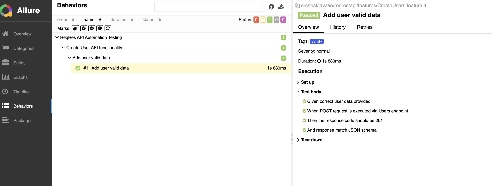
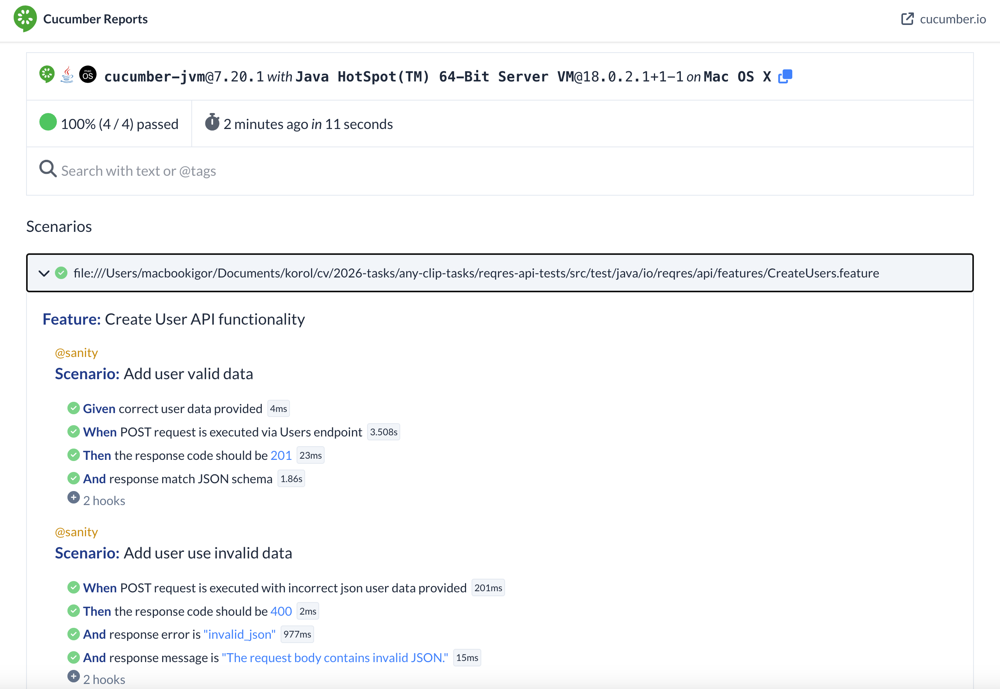

## API Automation Framework
## Project Name : reqres-api-tests

### 1. Project Structure

## Tech Stack
🌱 Spring | 🥒 Cucumber | 📦 Maven

Project build with Spring, Cucumber and JUnit5 frameworks

Test data and run configuration depends on environment to run

- **BaseApiLibrary** – general REST client configuration (base URL, headers)
- **UsersApiLibrary** – specific implementation for `users` endpoint
- **Step Definitions** – Cucumber steps, using Spring for dependency injection
- **ConfigProperties** – environment-specific configurations and API keys (dev, uat, prod)
- **Feature Files** – BDD-style test scenarios
- **Resources** – environment properties and test data
- **TestDataProperties** – specific to environment test data

---

### 2. Scalability

- Scale to **hundreds of API tests** using Cucumber feature files and reusable step definitions.
- Spring DI allows **shared context and objects** across tests without code duplication.

---

### 3. CI/CD Integration (Jenkins)

- Test execution via Maven:
- Run all tests from "sanity" suite from command line:

```clean compile test -Dcucumber.filter.tags=@sanity -Denv=dev```

By default run at env=dev if -Denv not specified as run parameter (See above)

### Jenkins Pipeline

- The pipeline uses a **Jenkinsfile** in the repository root.
- Pipeline stages:
    1. **Checkout** – clone the private repository using a GitHub Personal Access Token.
    2. **Setup Java & Maven** – configure JDK 18 and Maven 3.
    3. **Build & Test** – run all API tests using Maven (`mvn clean test verify`).
    4. **Generate Allure Report** – create Allure report (`mvn allure:report`).
    5. **Publish Allure Report** – publish results to Jenkins Allure Plugin.

### Environment Configuration

- Supports multiple environments: `dev`, `uat`, `prod`.
- Environment-specific configuration files are located under `src/test/resources/environment/{env}/config.properties` and `testdata.properties`.
- Default environment is `dev`. Override using Maven property:

  ```mvn clean test -Denv=uat```

---

### 4. Html Reporting - Allure

Allure is used for HTML reporting of Cucumber API tests.

Installing Allure
https://allurereport.org/docs/v2/install/ 

### Generate Report
```
mvn clean test
mvn allure:report
mvn allure:serve
```
Find report at path from project root and open in browser: 
```target/site/index.html```

### Generate Report with Allure command line tool

```allure serve target/allure-results``` 

It will automatically open HTML report in browser

<p align="center">
  <a href="src/test/resources/images/cucumber-report.png">
    
  </a>
</p>

### By default Cucumber generate build-in report and publish it on web

<p align="center">
  <a href="src/test/resources/images/cucumber-report.png">
    
  </a>
</p>
